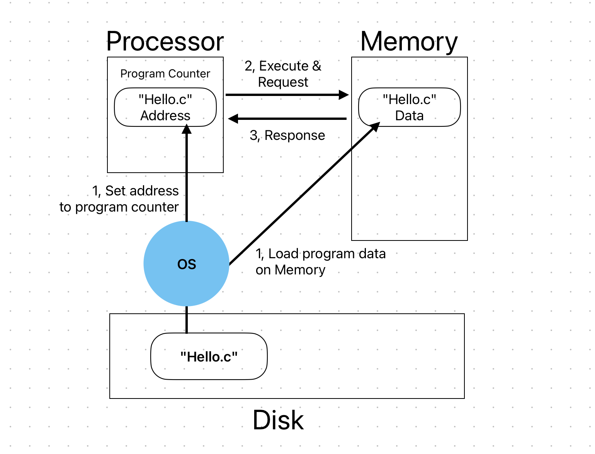

### 범위 : 1.4 ~ 1.7

> 핵심 키워드
> - Cache
> - Processor
> - Memory 

#### 내용 흐름 

위 그림은 컴파일을 끝내고 커맨드라인에서 `./hello`  프로그램이 실행 될때, 데이터의 이동 과정을 담았다.
아래는 단계별 상세설명이다.
1. OS가 디스크에 있는 hello 프로그램과 관련 데이터를 메모리에 적재하고, 프로세서의 program counter 을 적재한 메모리의 주소로 설정한다. 
2. 프로세서가 Program Counter에 의해 메모리로 데이터 요청 
3. 메모리가 요청한 데이터 반환 

즉 프로그램을 실행하기 위해선 디스크의 데이터를 메모리로 복사하고 다시 메모리에서 레지스터로 복사하는 과정이 필연적으로 발생한다. 거기다가 프로세서, 메모리, 디스크의 데이터 처리 속도가 차이가 나서, 이 간극을 줄이고자 캐시메모리를 도입했다.
저장장치들은 기본적으로 계층구조를 가지고있는데, 상위 저장장치가 하위 저장장치의 데이터를 임시로 저장하는게 캐싱이다. 레지스터 - 캐시(메모리) - 메모리 - 디스크 순서로 왼쪽에 위치할수록 처리속도가 빠르고, 오른쪽으로 가까워지면 저장 공간이 커진다. 
흥미로운 점은 캐시의 물리적 위치는 CPU 코어 속에 존재하는데, 데이터 접근 범위에 따라 l1, l2, l3 로 구분된다. 

#### 어려웠던 것들 
- 캐시 계층 구조가 필요성 : 프로세서가 자주 사용하는 데이터를 미리 저장해두고 재사용성을 높임으로써 효율적으로 작업 처리를 할수있음 
- 캐시 메모리와 메인 메모리의 차이 : 캐시 메모리는 cpu 안에 있는 메모리고, 메인 메모리는 물리적으론 DRAM으로 구성되어 논리적으로는 가상 주소 공간과 물리 주소 공간 키 쌍을 가지고 있음.
- Program counter 의 역할 : cpu 내부의 레지스터중 하나로, 수행될 작업 주소를 저장함