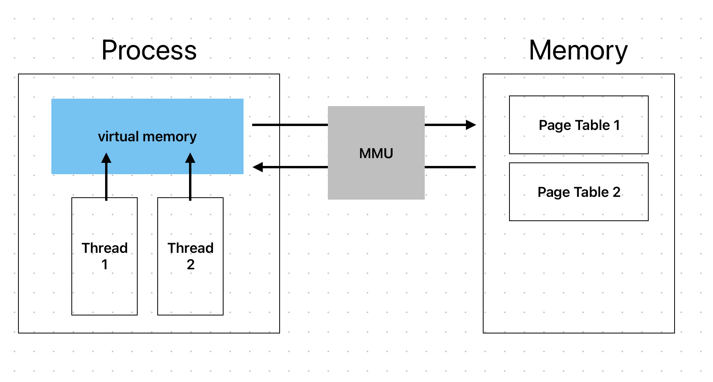

### 범위 : 1.7 ~ 1.8

> 핵심 키워드
> - Process
> - Thread
> - Context Switching

#### 내용 흐름 

0831.md 에서 응용 프로그램이 실행될때, 운영체제가 필요한 데이터를 메모리에 적제하고 CPU의 프로그램 카운터를 설정한다고 했다.  
프로세스는 cpu가 프로그램을 병렬적으로 실행하기 위한 일종의 가상 환경으로,  가상메모리 와 스레드 로 구성된다.  
운영체제가 cpu 에게 스레드의 실행 상태를 필요할때마다 전환하면서 프로그램이 실행되는데, 이를 Context Swtiching 이라 한다.
 
즉 특정 프로그램이 프로세스로 감싸지게 되어,cpu가 스레드를 실행시켜 프로그램(프로세스)를 처리한다.  

재밌는 점은 가상 메모리와 실제 메모리의 페이지 테이블의 연관성인데, 최초에 프로그램과 관련된 데이터들(e.g. 소스코드, 외부 라이브러리 ) 은 프로세스가 할당 될때 가상메모리에 올라가게된다. 
다만, 이 가상메모리는 개념적인 존재로, 여러 프로그램이 같은 가상 메모리 값을 가질수있다. 가상 메모리에 대한 매핑 테이블을 "페이지 테이블" 이라 하며, 운영체제가 메모리에 적제하는 데이터가 바로 이것이다.  

정리하자면, 프로세스는 프로그램의 추상화된 형태로, 운영체제가 스레드를 통해 프로그램의 실행 상태를 관리하며, 메모리와 페이지 테이블을 통해 객체 - 데이터를 실체화 한다.

#### 어려웠던 것들 
- 스레드: cpu가 실행하는 인스트럭션의 순서가 담겨있는데, 그럼 동일한 프로그램을 실행하면 어떻게 되는가?
- 제어권 : 제어권을 넘겨주는 목적지와 제어권 상태가 모호하다. 점유의 관점에서 봐야할수도 있을것이다.